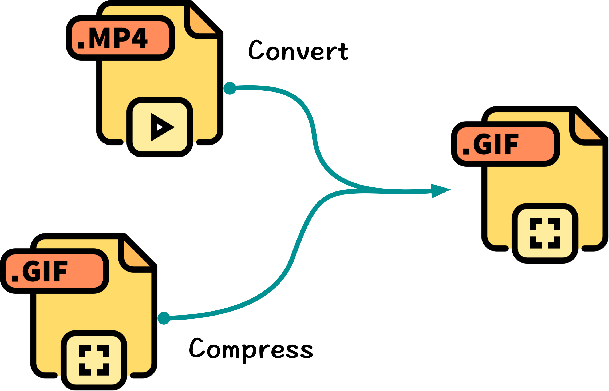
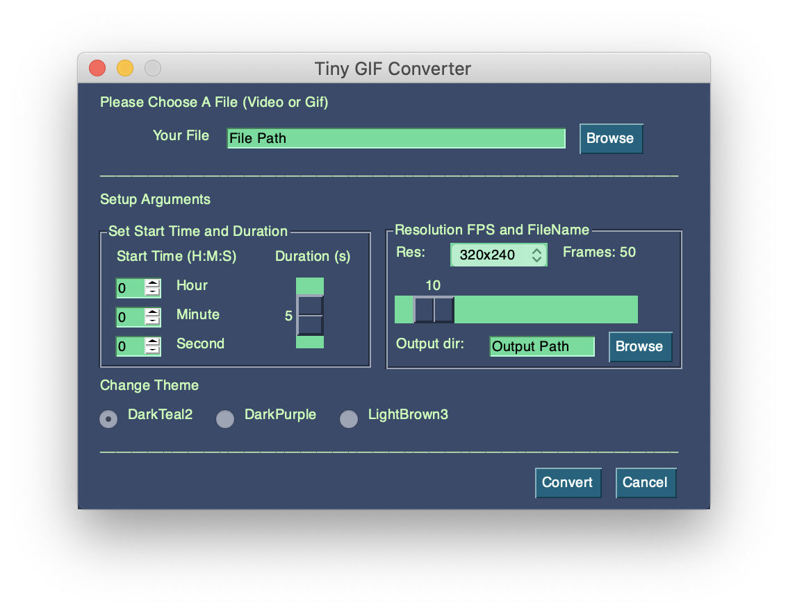
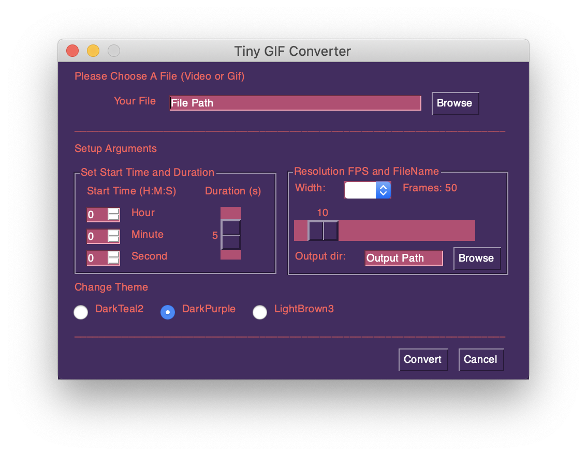
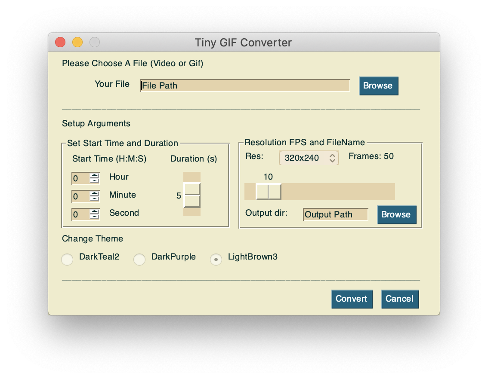

  

  

<br>

<p align="center">
  
</p>

<h2 align=center>Tiny GIF Converter</h2>
 
This is a tiny gif converter aiming to generate high quality yet compact gif images for WeChat official account writers or bloggers. This converter takes in a video or gif file, then it converts or compresses the file to a gif image, which is compatible with WeChat official account. The program has been tested on the Mac OS X with Python 3.6 environment. 

The converter uses [FFmpeg](https://github.com/FFmpeg/FFmpeg) to extract frames, then it uses [Gifski](https://gif.ski/) to generate high quality gif images. The GUI of this program is created by using [PySimpleGUI](https://github.com/PySimpleGUI/PySimpleGUI), just like its name, which is a simple and people-friendly Python GUI. Both [FFmpeg](https://github.com/FFmpeg/FFmpeg) and [PySimpleGUI](https://github.com/PySimpleGUI/PySimpleGUI) are cross-platform libraries, so it should be worked well on other OS theoretically. Please let me know if something went south in Windows or Linux.

## Appearance

Here is what the GUI looks like. You can change the theme which you like. Once you setup parameters, click the Convert button to start. The process just takes a few seconds.

|                      DarkTeal2                     |                     DarkPurple                     |                     LightBrown3                    |
|:--------------------------------------------------:|:--------------------------------------------------:|:--------------------------------------------------:|
|  |  |  |

## Sample

Here is a samlpe gif generated by this converter. Its resolution is 480 × 270 and FPS is 10. Notice that the file size is just 4.4M (no frame skipping). The sample file is captured from a YouTube Channel called [Carfection](https://www.youtube.com/user/XCARFilms).


## Method

It seems a paradox that we can generate a high quality gif file yet keep it in a relatively small size. The trick here is generating a custom color palette, so we can make full use of the color space and discard colors we don’t need.

> As you probably know, GIF is limited to a palette of 256 colors. And by default, FFmpeg just uses a generic palette that tries to cover the whole color space in order to support the largest variety of content.

This converter uses [Gifski](https://gif.ski/) to generate  per-frame palettes, meanwhile, combines palettes across frames, achieving thousands of colors per frame for maximum quality. For more details about the color palette, please see the reference links down below.

## Requirements 

* FFmpeg
* Gifski
* PySimpleGUI

## Setup

Here is an installation guidance for Mac users. Windows and Linux are following the same setup procedure.

### Mac OS X

The simplest way to install FFmpeg and Gifski on Mac is using [Homebrew](https://brew.sh). Run the following command in macOS Terminal (zsh) to install it:

``` bash
$ /bin/bash -c "$(curl -fsSL https://raw.githubusercontent.com/Homebrew/install/master/install.sh)"
```

Once it is done, use the following command to install FFmpeg and Gifski:

``` bash
$ brew install ffmpeg
$ brew install gifski
```

The last step is installing PySimpleGUI:

``` bash
$ pip install pysimplegui
```

Here [Miniconda](https://docs.conda.io/en/latest/miniconda.html) is recommended, which provides a lightweight virtual environment for us.

Now you are all set!

## Run

Use the following command to run the program:

``` bash
$ python main.py
```

~~I may release an executable file in the future, sorry for the inconvenience for now.~~

The first packaged app for Mac users is released. If you don't have a Python interpreter on your computer, you can [download](https://github.com/fengredrum/tiny-gif-converter/releases/download/v0.1-alpha/tiny-gif-converter.MacOS.zip) the zip file. Unzip it then run the following command in Terminal:

``` bash
$ cd /Path of the app
$ ./TGC
```

If you still don't want to install anything, you also can try it on Colab.

[](https://colab.research.google.com/github/fengredrum/tiny-gif-converter/notebook/tiny-gif-converter-demo.ipynb)

Some files are provided in the sample folder just for testing. They are from [T. E. D. D. 1104](https://github.com/ikergarcia1996/Self-Driving-Car-in-Video-Games) and an [ICLR 2020 paper](https://openreview.net/pdf?id=SyxrxR4KPS) respectively.

## Overview

``` python
// main.py

import PySimpleGUI as sg

from convert_to_gif import gif_converter

# ---------------------- Window Layout ---------------------- #
layout = [***]

# ---------------------- Create Window ---------------------- #
window = sg.Window('Tiny GIF Converter', layout)

# Event Loop to process "events" and get the "values" of the inputs
while True:
    event, values = window.read()
    if event in (None, 'Cancel'):  # if user closes window or clicks cancel
        break
    elif event == 'Convert':
        # Converting
        if gif_converter(**kwargs) == 'Done':
            break
```

``` python
// convert_to_gif.py

import subprocess

# Extract frames
subprocess.call([
    'ffmpeg',
    '-ss', start_time,  # start time
    '-t', duration,  # duration
    '-i', load_path,  # original file dir
    '-vf', "fps=" + fps + ", scale=" + frame_width + ":-1",
    '-pix_fmt', 'rgb24',  # pixel formats
    # output file dir
    '-y', 'tmp/frame%04d.png',
    ])

# Create GIF
out_file_name = os.path.basename(load_path) + '_converted.gif'
ex = subprocess.Popen("gifski --fps " + fps + " -o " +
        os.path.join(save_path, out_file_name) +
        " tmp/frame*.png", 
        stdout=subprocess.PIPE,
        universal_newlines=True, shell=True)

while ex.poll() == None:
    yield ex.stdout.readline()
```

## References

1. https://superuser.com/questions/556029/how-do-i-convert-a-video-to-gif-using-ffmpeg-with-reasonable-quality

2. http://blog.pkh.me/p/21-high-quality-gif-with-ffmpeg.html

3. https://stackoverflow.com/questions/42980663/ffmpeg-high-quality-animated-gif

## License

[Apache License 2.0](LICENSE)
