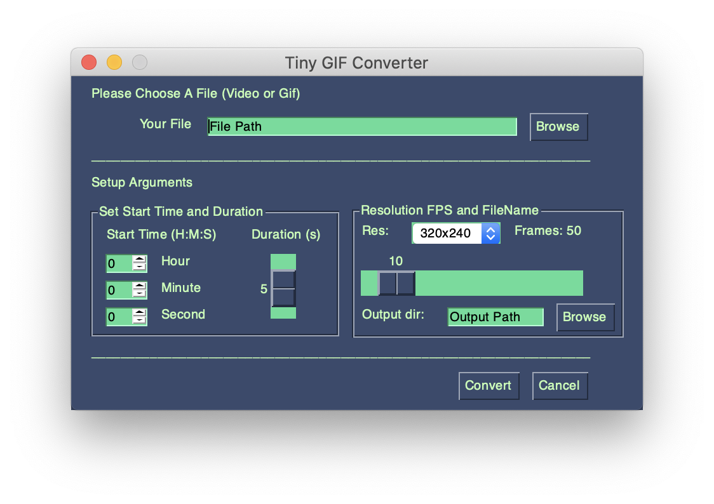

    <br>


<p align="center">
  
</p>

<h2 align=center>Tiny GIF Converter</h2>
 
This is a tiny gif converter for WeChat official account writers or bloggers. This converter takes in a video or gif file, then it converts or compresses the file to a gif image, which is compatible with WeChat official account.

## Requirements 

- FFmpeg
- PySimpleGUI

## Setup

### MacOS

```bash
$ brew install ffmpeg
```

```bash
$ pip install pysimplegui
```

## Run

```bash
$ python main.py
```

## Overview

```python
// main.py

import PySimpleGUI as sg

from convert_to_gif import gif_converter

# ---------------------- Window Layout ---------------------- #
layout = [***]

# ---------------------- Create Window ---------------------- #
window = sg.Window('Tiny GIF Converter', layout)

# Event Loop to process "events" and get the "values" of the inputs
while True:
    event, values = window.read()
    if event in (None, 'Cancel'):  # if user closes window or clicks cancel
        break
    elif event == 'Convert':
        # Converting
        if gif_converter(**kwargs) == 'Done':
            break
```

```python
// convert_to_gif.py

import subprocess

# Convert file
subprocess.call([
                'ffmpeg',
                '-ss', start_time,  # start time
                '-t', duration,  # duration
                '-i', load_path,  # original file dir
                '-pix_fmt', 'yuv420p',  # pixel formats
                '-r', fps,  # fps
                '-s', frame_size,  # resolution
                # output file dir
                '-y', os.path.join(save_path, out_file_name),
                ])
```

## Appearance

<p align="center">
  
</p>

## License

[Apache License 2.0](LICENSE)


